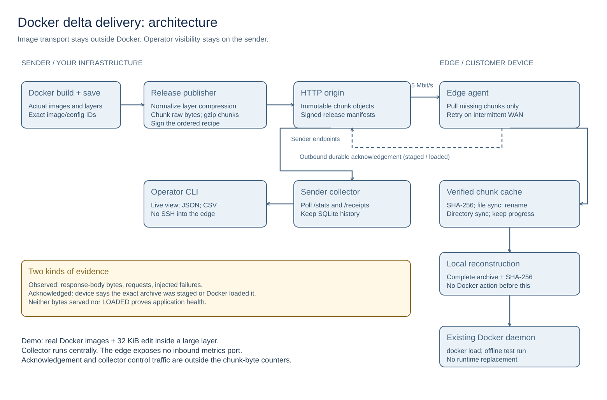

# Edge Delta Lab

**Deliver Docker image updates over slow or intermittent links without downloading unchanged chunks again.**

A publisher watches a standard Registry v2 repository and signs releases. A receiver downloads only missing chunks from the hub, verifies and rebuilds the image archive, then optionally loads it into its local Docker daemon. Completed chunks survive restarts. The first delivery fills a separate cache; existing Docker images do not seed it.

**Docker never pulls from Edge Delta. Loading is not starting or replacing containers.** This is an experimental delivery system, not a production-ready fleet updater.



[Architecture and trust model](docs/ARCHITECTURE.md) · [Editable diagram](docs/diagrams/architecture.html)

## Install

Use two Linux hosts: a publisher/hub with Docker Compose, and a receiver with systemd and a local Docker daemon. Both need Python 3, make and the complete Linux bundle; receiver installation needs sudo. No Go or source checkout is required. Use **single-platform image tags matching the receiver architecture**; multi-platform indexes are unsupported. Arm64 bundles exist, but arm64 runtime remains unvalidated; see [testing and limits](TESTING.md).

Download the published [v0.1.2](https://github.com/syscode-labs/edge-delta-lab/releases/tag/v0.1.2) bundle on each host (replace `linux-amd64` with `linux-arm64` if needed):

```sh
curl -fLO https://github.com/syscode-labs/edge-delta-lab/releases/download/v0.1.2/edgelab-v0.1.2-linux-amd64.tar.gz
curl -fLO https://github.com/syscode-labs/edge-delta-lab/releases/download/v0.1.2/SHA256SUMS
sha256sum --ignore-missing -c SHA256SUMS
mkdir edgelab-v0.1.2
tar xzf edgelab-v0.1.2-linux-amd64.tar.gz -C edgelab-v0.1.2
cd edgelab-v0.1.2
```

### Publisher and hub

```sh
cp hub.env.example hub.env
# Edit hub.env: registry URL, repository, tag filter and installation directory.
make hub-up
make hub-status
```

Setup starts persistent services and creates trust/state once. Keep the private signing key and any registry password on the publisher host. Use new immutable version tags for updates; do not reset keys or sequence counters on restart.

The hub is **loopback HTTP**, not a public endpoint. Before connecting a remote receiver, configure [trusted HTTPS](OPERATIONS.md#tls-and-network-boundaries) using your existing reverse proxy or the optional, removable [Caddy mTLS wrapper](MTLS.md). Never expose the raw listener or disable certificate verification.

### Receiver

Transfer **only** `keys/publisher.pub` from the hub installation through a trusted channel. If using mTLS, provision the separate client certificate as described in [MTLS.md](MTLS.md).

```sh
cp receiver.env.example receiver.env
# Edit receiver.env: HTTPS hub URL, public-key path, device ID and Docker-load opt-in.
sudo make receiver-up
sudo make receiver-status
```

Docker loading grants root-equivalent daemon access; leave it off to stage/verify only. Push an eligible image tag, then a new version tag. Watch `sudo journalctl -u edgelab-receiver`: `staged` means verified archive, `loaded` means verified import—not running or healthy.

## Guides

- [Operations: configuration, lifecycle, security and storage](OPERATIONS.md)
- [Optional mTLS transport](MTLS.md)
- [Embedding from Go](GO_EMBEDDING.md)
- [Tests, retained proof, measurements and remaining limits](TESTING.md)
- [Developer/native commands and optional Helm hub](docs/DEVELOPMENT.md) · [Optional monitoring](docs/GRAFANA.md)

No particular registry vendor, VPN, Kubernetes or monitoring service is required.
