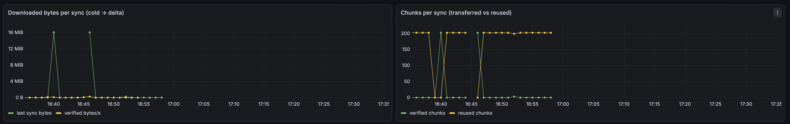

# See delivery progress in Grafana

Grafana draws charts of delivery activity: how much a client downloaded, how many chunks it reused, whether verification failed, and whether the monitoring source is available. It is **optional**. Publishing, downloading, verifying, and loading images do not depend on it. You can use your own Grafana and Prometheus; Grafana Cloud is not required, and this repository does not provide a public hosted dashboard.

## How the numbers reach Grafana

The implemented path is:

```text
Hub or client → local Unix admin socket → edgelab-exporter /metrics
             → Prometheus-compatible collector and storage → Grafana
```

An **exporter** turns the daemon's status into numeric metrics. **Prometheus** collects these numbers periodically (a “scrape”) and stores their history. Grafana queries that history through a Prometheus datasource; it does not read the admin socket or collect the metrics itself.

For native daemons, follow the [README exporter commands](../README.md#observe-delivery). Start both a hub exporter and a client exporter: **hub metrics alone cannot tell you what a client verified or reused**. The exporters read local admin sockets, not remote receiver files. Clients do not need inbound delivery connections; monitoring still needs either a local collector or a secured route to the exporter.

Alternatively, the [Alloy example](../deploy/helm/edgelab-hub/edgelab-proof.alloy) scrapes exporters and uses **remote write**: sending collected samples to another metrics store. Adapt its addresses and instance labels; supply `EDGELAB_REMOTE_WRITE_URL`, `EDGELAB_REMOTE_WRITE_USER`, and `EDGELAB_REMOTE_WRITE_TOKEN` privately. The example sends only metrics matching `edgelab_.*|up`. This is a Prometheus metrics path, not an OpenTelemetry setup.

## Enable the Helm exporter

Skip this section if you already run the native exporters. The [runtime guide's Helm prerequisites](DOCKER_RUN.md#helm-kubernetes) still apply: a cluster-accessible built image, compatible persistent volumes, populated origin data, and working non-root storage permissions. The chart deploys the hub, not publishers, clients, Prometheus, or Grafana. It supplies no ServiceMonitor or PodMonitor to configure collection automatically.

From the repository root, save the following as `work/grafana-values.yaml` (create `work/` if needed). Replace `YOUR_REPOSITORY` and `YOUR_TAG` with your built hub image in **both** places; exporter image settings are independent of hub image settings.

```yaml
image:
  repository: YOUR_REPOSITORY
  tag: YOUR_TAG
hub:
  events: true
  rateKbit: 5000
exporter:
  enabled: true
  image:
    repository: YOUR_REPOSITORY
    tag: YOUR_TAG
  port: 9108
  instance: hub-01
```

Check the configuration locally first:

```sh
helm lint deploy/helm/edgelab-hub -f work/grafana-values.yaml
helm template edgelab-hub deploy/helm/edgelab-hub \
  --namespace edgelab -f work/grafana-values.yaml
```

When the prerequisites are satisfied, install it (or update that release):

```sh
helm upgrade --install edgelab-hub deploy/helm/edgelab-hub \
  --namespace edgelab --create-namespace -f work/grafana-values.yaml
```

For an existing installation, merge these settings into its maintained values file rather than replacing its other custom settings with this minimal example.

The exporter runs `/usr/local/bin/edgelab-exporter` as a second container, reads `/state/admin.sock`, and exposes `/metrics` on service port `9108`. The service remains ClusterIP by default. Rendering confirms the generated configuration, **not** a successful cluster installation or working monitoring.

## Collect metrics and import the dashboard

For Prometheus running inside the same cluster, add this job to its existing `scrape_configs` list and reload it through your normal configuration process:

```yaml
scrape_configs:
  - job_name: edgelab
    scrape_interval: 15s
    honor_labels: true
    static_configs:
      - targets: [edgelab-hub.edgelab.svc.cluster.local:9108]
        labels:
          instance: hub-01
          role: hub
```

The address assumes the release and namespace above and the usual `cluster.local` DNS suffix. Change it for your cluster. `honor_labels: true` preserves the exporter's `job`, `instance`, and `role` labels. Use a distinct stable instance label for each daemon. This job collects **only the hub**; add client targets reachable from your collector or run a collector beside each client. For the native README example, a collector on the same host can reach the client at `127.0.0.1:9110` and the hub at `127.0.0.1:9109`. Loopback addresses inside another container or host refer to that container or host, not your daemon.

Then, in your own Grafana:

1. Add or select a Prometheus datasource pointing to the store receiving these samples.
2. Import [the dashboard JSON](../deploy/helm/edgelab-hub/dashboards/edgelab-delivery-cache.json) through Grafana's dashboard import screen.
3. Select that datasource in the dashboard's `datasource` selector.
4. Edit the panel queries that contain a fixed `instance="..."` client filter. Replace the historical proof label with your actual client label, such as `client-01`. Check the stored labels in Grafana Explore; every supplied query also expects `job="edgelab"`.
5. Change the time picker to your run, such as **Last 30 minutes**. The JSON defaults to a historical window on **2026-09-19, 15:44–15:54 UTC**, not the current time.
6. Run a cold delivery and then publish a changed release to the same client's persistent state. Keep collecting throughout both transfers.

The dashboard has ten panels. Importing it does not provision exporters or data. A successful import with empty panels is not monitoring verification.

## Read the panels

| Panel | What it tells you |
| --- | --- |
| Downloaded bytes per sync (cold → delta) | Downloaded bytes for the last sync. A large cold download followed by a smaller update is the expected reuse pattern. Rates appear only in the separate throughput panel, labeled bytes per second. |
| Chunks per sync (transferred vs reused) | Newly downloaded and verified chunks versus already cached chunks reused by the last sync. Reuse is the client's verified content cache, not Docker's image store. |
| Verified throughput | Downloaded bytes that passed verification per second. It is not total network bandwidth. |
| Integrity (verified chunks vs zero failures) | Cumulative verified chunks and integrity failures. Check that the failure series is present and stays zero; an absent series is not evidence of zero failures. |
| Sync result / state | Successful and failed sync counts, plus the reported client state. `staged` means a verified archive; `loaded` does not mean containers are running or healthy. |
| Exporter / source health | The minimum `edgelab_source_up` across matching sources. A zero means at least one reported source is unavailable; also check scraper `up` separately for unreachable exporters. |
| Snapshot age | Seconds since the last successful admin snapshot. Growing age means you are looking at an increasingly old source reading. |
| Cache occupancy and activity | Hub memory-cache occupancy ratio, cache hits/s, and disk reads/s. These have different units; this is not client disk-cache usage. |
| Requests and retries | Client request rates and retries/s. Investigate persistent retries alongside client logs and connection health. |
| Hub body throughput | Bytes served per second, split into chunk and metadata bodies. Serving bytes is not proof that a client received and verified them. |

Last-sync values describe the most recently completed check, not an immutable release history. Later no-change checks can show zero downloaded bytes and many reused chunks. Repeated points can be scrapes of the same result, not new transfers. Keep the original transfer window and client summaries when comparing cold and incremental delivery. Counters can reset when the daemon restarts.

## Latest supplied screenshot and measured context



This is a **3938 × 625 pixel crop** of the latest user-supplied Desktop capture, `Screenshot 2026-09-19 at 17.35.17.png`. The filename records the capture's local wall-clock time; its timezone is not established here. Only the two top panels are included. Browser chrome, URLs, identity, and lower panels containing private machine names are excluded. The visible graph window is wider than the dashboard JSON's saved default.

The crop illustrates the cold-download peaks and subsequent reuse. Exact values below come from [retained query evidence](../evidence/v4-productization/v31-grafana/README.md), not estimates read from the picture:

The unchanged historical crop predates the panel-unit correction: its yellow line in the left panel is verified **bytes per second**, not another byte total. The current dashboard JSON removes that rate from the bytes panel; use the separate throughput panel for rates.

| Measurement | Cold delivery | Later update |
| --- | ---: | ---: |
| Downloaded chunk body bytes | 16,791,337 | 249,778 |
| Newly downloaded and verified chunks | 202 | 3 |
| Reused chunks | — | 202 |

Across that measured proof, integrity failures stayed **0** and successful syncs reached **2**. Those totals are in retained evidence; their panels are deliberately outside this crop. The proof used a Linux hub and Linux client over Tailscale with a 5 Mbit/s client ingress cap, staging synthetic Docker archives. It was not a production-image benchmark or a registry-pull comparison. Byte counts exclude metadata, headers, retransmissions, and VPN overhead; see [experiment boundaries](EXPERIMENTS.md).

The earlier evidence run recorded authenticated dashboard screenshot/render verification as **NOT RUN**. This later user-supplied screenshot is now included after privacy-safe cropping and local visual inspection; it does not retroactively establish automated capture or authenticated rendering. It is historical evidence, **not proof that a hosted dashboard or service is currently available**. No fresh live dashboard query, authenticated capture, or cluster deployment is claimed by this documentation update.

## If panels are empty

1. **Check the datasource and time range first.** The imported JSON's old time window and fixed client filter are common causes. Look for `edgelab_source_up` in Explore without the instance filter, then inspect its labels.
2. **Check the exporter endpoint.** With the native README client exporter running, use:

   ```sh
   curl -fsS http://127.0.0.1:9110/metrics
   ```

   For the Helm hub, forward the private service port in one terminal:

   ```sh
   kubectl --namespace edgelab port-forward service/edgelab-hub 9108:9108
   ```

   In another terminal:

   ```sh
   curl -fsS http://127.0.0.1:9108/metrics
   ```

3. **Distinguish connection health from source health.** Scraper `up=1` means the scrape succeeded. `edgelab_source_up=1` means the exporter read its admin source. If the latter is zero, check daemon startup, socket path, and socket permissions. The exporter does not substitute zero or stale hub-cache samples for an unavailable source.
4. **Check collection and forwarding.** If `/metrics` works but Explore has no samples, inspect target reachability, stored labels, collector logs, and any remote-write destination or credential errors. Do not paste tokens into shared logs.
5. **Check that a client was collected during delivery.** A hub-only deployment cannot populate client panels. Allow multiple scrapes for the dashboard's one-minute rate queries; a zero rate after a completed transfer can be normal. No data is different from zero activity.

## Keep monitoring private

The exporter emits numeric delivery/cache measurements and labels such as instance, role, request kind, and client state; it does not export archive contents or signing keys. Labels and timing still reveal machine identity and operational activity. Use neutral labels, restrict dashboard access, and review any backend's retention and sharing settings.

The exporter has no built-in HTTP authentication or TLS. Keep native listeners on loopback where possible and restrict Kubernetes metrics access to trusted collectors. Do not expose port 9108 or admin sockets publicly. With remote write, metrics and labels leave the machine for the destination you configure; keep credentials outside source control and screenshots.

Before sharing a dashboard image, inspect legends, titles, URLs, browser chrome, and lower panels for private names or account details. The image above is a deliberately limited crop, not the unredacted original.
